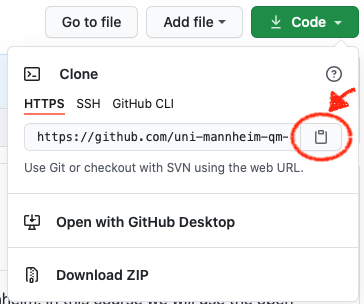
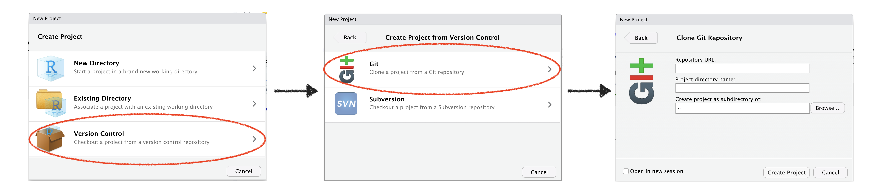
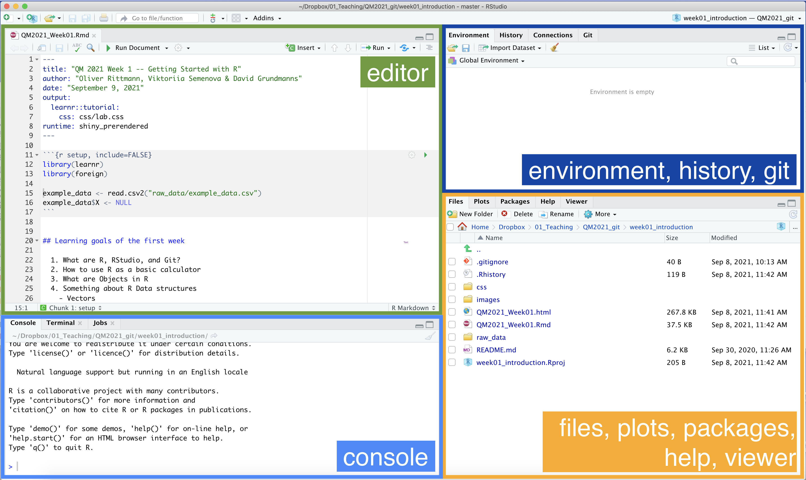

## What are R, RStudio, and Git?

### What is **R**?

`R` is a programming language designed to help you perform statistical analysis, create graphics, and later on write your own statistical software. `R` is becoming increasingly popular and knowledge of R will help you on the job market. `R` is probably the most versatile statistical tool out there (and it's free and open-source so you can literally use it anywhere). It is for example used in all fields of academia, from biology to economics, and outside academia including

 - Wallstreet
 - The Economist
 - [BBC](https://blog.revolutionanalytics.com/2018/06/ft-bbc-uses-r.html)
 - Google Analytics
 - [NY Times graphics department](http://www.nytimes.com/interactive/2012/08/10/sports/olympics/passing-patterns-of-the-uss-top-playmakers.html)
 
 
### What is **RStudio**?

RStudio is a great graphical user interface for `R`. In recent years, a growing number of features have been added to this graphical user interface, which makes it the preferred choice for learning `R`, especially among beginners. You can think about it as `R` being the engine of the car and RStudio being the dashboard. 

### What are **RStudio Projects**?

RStudio projects make it straightforward to divide your work into multiple contexts, each with its own working directory, workspace, history, and source documents. A project is basically a folder on your computer that holds all the files relevant to a particular piece of work. Working in RStudio Projects has multiple advantages:

  - Once an RStudio Project is set up, you do not have to worry about your working directory anymore.
  - When opening an RStudio Project, a new `R` session (process) is started. This makes sure that things you do in different projects do not mess up.
  - You can open and work with multiple RStudio projects at the same time.
  - RStudio projects can easily be exported to and imported from GitHub.

### What are **Git** and **GitHub**?

Git is a version control system that makes it easy to track changes and work on code collaboratively. GitHub is a hosting service for `git`. You can think of it as a public Dropbox for code but on steroids. With version control, you will build your projects step-by-step, be able to come back to any version of the project, and accompany everything with human-readable messages. 

As a student, you even get unlimited private repositories which you can use if you don't feel like sharing your code with the rest of the world (yet). We will use private repositories to distribute code and assignments to you. And you will use it to keep track of your code and collaborate in teams. 

### What is a **Git Repository**? 

A Git repository is a space where you store and manage a project. It contains all of your project's files and stores each file's revision history. It's common to refer to a repository as a repo. 

We will you one repository for each lab and one repository for each homework assignment. You can directly import ("pull") repositories via RStudio and save them on your computer. If you changed something in your project, you can easily upload ("push") the new version to GitHub. GitHub will keep track of all changes you made over time within your project.

## Workflow overview

Our workflow will appear a bit tricky at the beginning but we are sure that you will handle it with ease very soon. We assume that by now you downloaded and installed R and Rstudio and have your personal GitHub account.

The course has its own page on GitHub, you can find it here: [https://github.com/uni-mannheim-qm-2021](https://github.com/uni-mannheim-qm-2021). This is the place where you can find all relevant material for the lab sessions. It is also the place where you download and hand in your homework assignments. 

So how does this work?

#### Get the URL of the repo for the current week

Go to [https://github.com/uni-mannheim-qm-2021](https://github.com/uni-mannheim-qm-2021) and click on the repository for the current week (this week, this is called `week01_introduction`). Now, click on the green **Clone or download** button and select **Use HTTPS** (this might already be selected by default, and if it is, you'll see the text Clone with HTTPS as in the image below). Click on the clipboard icon to copy the repo URL.

#### Import the repository in RStudio

  1. Open RStudio.
  2. Click on `File` on the top bar and select `New Project...`.

  3. Select `Version Control`. 
  4. In the next window, select `Git`.
  5. In the final window, paste the repo URL you grabbed from GitHub in the `Repository URL` window. Click on `Browse` to select the folder on your computer where you want to store the project.
  6. Click on `Create Project`.
  
#### Get working
  1. Open the `.Rmd` file that is stored in the project (in week 1, this is called `QM2021_Week01.Rmd`).
  2. Hit the **Run Document** button.

## The RStudio interface

The RStudio interface has four panes:

  - **Editor**: This is were you usually code. You can either use .Rmd (R Markdown) or .R (plain R code) files.
  - **Console**: This is where the results appear once you execute your R-code. You can also directly type R-code into the console and execute it. However, we cannot save this code which is why we usually work in the Editor.
  - **Environment**: Here you have an overview over all the objects currently loaded in your environment. You will learn more about objects later in the course.
  - **Files, Plots, Packages, Help, Viewer**: Plots and other things will appear here, don't worry too much about it for the moment.
